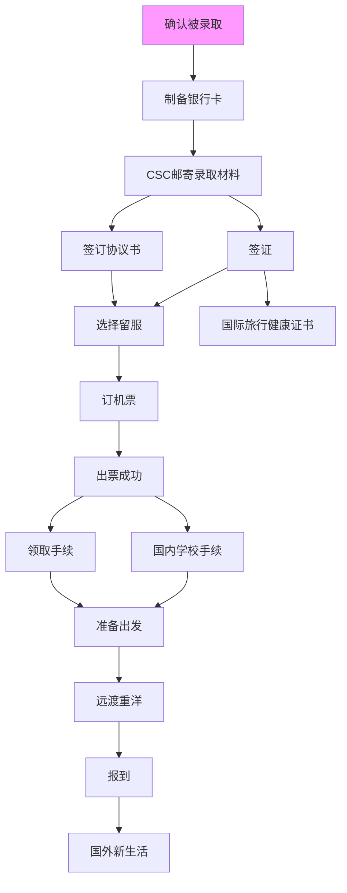

###### CSC 瑞典之行  **Lund严** *(C)2020. 版权所有*

[TOC]

**致谢**
感谢KTH潮歌、Lund超哥、CTH壹哥、KTH勇哥、KTH姿怡、KI娅姐、林雪平源源、Lund修飞、Lund昕怡、Lund晨姐、UmU雨晴、SU萍萍、SU点点、SLU峰哥、Lund昊哥、KI龙哥、SU芸姐、CTH博哥、UU铎哥、CTH飞、杜巍隆德大学等新老司机提供的信息，同时参考KTH潮哥《[喜报之后，启程之前--叨叨叨独家行前指导](https://mp.weixin.qq.com/s?src=11&timestamp=1590310378&ver=2357&signature=nFEQiVjEysw3YuLn-h03hf9ybFXczwfV0cF9Dy71vpeLarJg9pcu0TX4O-Rm0WJQla7AAsTPl5c4bgVW33RXeuX8LXmX*rT8UQC2FVUAq-xLxO0NWS800jepVFInfCLl&new=1)》、《[CSC-KI系列之新生入学（前）指南](https://mp.weixin.qq.com/s?__biz=MzI4NDU0NjU5NA==&mid=2247484864&idx=1&sn=afe9c9abd2e36a5f8457a03ad0dec0d0&chksm=ebf8868ddc8f0f9ba41aa69bb2acf16c4d0a8f871686ee59ce11ce3687a1141919af270ae9e9&scene=21#wechat_redirect)》《[补充一 | CSC-KI系列之新生入学（前）指南](https://mp.weixin.qq.com/s?__biz=MzI4NDU0NjU5NA==&mid=2247484878&idx=1&sn=2eea75f03f64b37e8f5f1f5e23a2c5ae&chksm=ebf88683dc8f0f95f63b45ab2211daf6cfdb0208e5ffe99e10caf3a21a8555fee93de5b9f945&mpshare=1&scene=23&srcid=06046DNrDvqKXb8CeN1PXYMF#rd)》、《[补充二 | CSC-KI系列之新生入学（前）指南](https://mp.weixin.qq.com/s?__biz=MzI4NDU0NjU5NA==&mid=2247484954&idx=1&sn=5ca91a5234b7cd10f62106774aef9c2f&chksm=ebf88557dc8f0c416998b7c1f958e7ffc4cb05e5b16ff9d329bcadc668e877503b261136c2ef&mpshare=1&scene=1&srcid=0613bh5UAGREV7su9wzZqomV#rd)》、《[初到瑞典你急需的技能包](https://mp.weixin.qq.com/s?__biz=MzI4NDU0NjU5NA==&mid=2247483764&idx=1&sn=3aa5648719e22888a3df64090228c685&chksm=ebf88239dc8f0b2f2907d8cef4652e020f3885095614d05cfd3b4484b2bcfc63488ccf5a1dfc&mpshare=1&scene=1&srcid=0613XqAUv9iKyJnfmQpxjrEX#rd)》。时间仓促，排版凌乱，欢迎补充和修改。另外声明一点，本文仅是经验贴，仅供参考，如有错误遗漏，请以`#瑞典驻华大使馆(北京)#msg`的规定为准。

# 总流程图(请用电脑查看)

---

# CSC 相关网站

[`#apply 网站(IE 浏览器限定)#notice`](http://apply.csc.edu.cn)
- [`#apply 网站(IE 浏览器限定)#notice`](http://apply.csc.edu.cn)。http://apply.csc.edu.cn。申请、收获大红喜报、下载`#出国留学人员须知#tips`、选择`#留服#msg`、`#留学协议书#tips`等业务。
- [`#s 网站#notice`](https://s.csc.edu.cn)。https://s.csc.edu.cn。制备 `#CSC 卡#msg`、网上报到、申请变更、回国机票、期满结算、`#研修报告#tips`等业务。
- `#留服网站#notice`。根据个人喜好在 http://apply.csc.edu.cn 选择`#留服#msg`。`#留服#msg`的作用：订购往返机票、报销签证费、下载`#报到证#tips`。

---

# CSC 邮寄录取材料

一份中文的`#国家留学基金资助出国留学资格证书#tips`，最终去向：出国后，邮寄给当地教育处。属于报到手续。
两份英文的`#英文的资助证明#tips`，办理签证时需要用到。

---

# `#留学协议书#tips`

- [下载协议书 PDF](http://211.81.63.130/cache/4/03/apply.csc.edu.cn/1db35e5893612800285d5c7a91ade9e4/cscprotocol.pdf)，填写协议。
其中有些个人信息可以参见 CSC 寄给你的`#国家留学基金资助出国留学资格证书#tips`。
- 在[这个网站](http://apply.csc.edu.cn/csc/main/person/stuAbroad/xyDepositPrompt.jsf)填写一下保证人的信息。
- 然后把`#留学协议书#tips`、本人和两位保证人的`#身份证复印件#tips`邮寄或面交至 CSC 即可。
  收件人：csc 法律与综合事务部，地址：北京市西城区车公庄大街 9 号 A3 楼 13 层，邮编：100044，电话：010-66093562

PS:
-  `#留学协议书#tips`无须公证
- [关于取消国家公派出国留学协议公证要求及使用电子协议的通知](https://www.csc.edu.cn/chuguo/s/1603)

---

# 签证

目前来看，对于联陪的同学，签证选择有三种渠道：working in Sweden（工作签 visiting researcher），studying in Sweden（学生签），visiting Sweden（访问签doctoral exchange students）。
攻博的就是工作签和学生签的选择了。

Visiting Sweden 需要面申，必须先买保险，最长居留时间是一年，且按`#瑞典移民局#msg`网页内容的理解，访问签不能申请延期，但2018年也有在`#马尔默移民局#msg`延期成功的；其他两种都可以网申，时间可超过一年，一年及以上可以不买保险。

在`#瑞典移民局#msg`的网页有各类型预估办理时间（Time to a decision）。
visiting Sweden 是 14 天，是最快的。其他两种都是 1-3 个月，建议合理规划时间。按照 2017 年经验，联陪办理工作签会稍久一点。

选择哪种渠道取决于你的申请院校、导师要求以及最重要的你的准备材料。看你符合哪种形式及办理时间要求，然后自己安排。
在瑞典一年及以上的同学，建议申请学生签和工作签，可以申`#人口号#idle`（最重要的。在后面介绍办理`#人口号#idle`的部分有其作用的介绍）。短于一年的，不能申请`#人口号#idle`，就看自己的时间安排和学校导师建议来选择了。满四年学生签申请永居也比工作签容易。在瑞典学生身份的购物优惠会多一些。从`#居留卡#spare`的卡面信息，看不出三种签证的区别。

一般来说学生签和访问签一年及以上的话，肯定是可以办理`#人口号#idle`的，按之前的理解访问签是不能办理的，但是 2017 年也有一个同学 Lund 昊哥以 访问签 办理了`#人口号#idle`，所以猜测由于办理签证的`#瑞典移民局#msg`和办理`#人口号#idle`的税务局两套系统的原因，又加上证明了个人在瑞典居住能满一年。个例仅供参考。
具体情况如下。
访问签 批准时间为 20170930-20180929（满一年），实际抵达瑞典时间为 20171019。初次申请`#人口号#idle`被拒后，补交了来瑞典的`#电子客票行程单#tips`、留基委的自资助证明和住房合同。证明确实能在瑞典停留满一年，最终20171108下发`#人口号#idle`。

攻博的一般都是学生签，有些学校给职位的话就是工作签了，考虑后面`#人口号#idle`的申请、无需面申的便利、延期申请的便利，对于一年及以上的联陪也建议尽量办理学生或工作签。
联陪的多位老司机经验，建议跟攻博用一个申请通道，就是 studying in Sweden，如果你申请的学校、研究所和导师有要求则另当别论，如KI的联陪是用Working in Sweden工作签通道以visiting researcher身份。有任何疑问，以`#瑞典驻华大使馆(北京)#msg`答复为准。（以前来KI，无论是联培还是攻博都必须先申请visiting researcher，一年后攻博的人再改成学生身份。2018 年新改的政策是，攻博的直接申请学生签，因为今年是第一年，所以估计得等到九月开学后攻博的小伙伴才能拿到入学证明，然后再申请签证。因此想提醒来KI攻博的小伙伴，及时关注学校的消息—20180818 KI子龙）
对于`#瑞典移民局#msg`网页关于三个申请渠道的说明内容，每个人的理解不一样，即使是签证官也有很大的主观因素，2017年我与另一同学除国内院校不一样，上传材料都相同，但是他顺利通过了学生签，而我的被认定不符合。如果`#瑞典移民局#msg`判断你的材料不是符合学生签，会给你改签证形式，我的就是被改成了访问签。（我是联培两年，上传了[`#Hosting Agreement (231011 表)#tips`](../sources/231011.pdf)申请到了一年的学生签，好像今年联培的学生签全都只批了一年（特地写邮件问了，一年指的是2018.10.15-2019.10.14，不需要购买保险），不知道两年联培申请工作签的同学怎样，是否直接可以批准两年签证—20180828 SU芸。2017 年联陪大部分都给的一年签，也有 14 个月的，2018 年已经知道有人拿到了两年工作签—20180828 CTH飞）。
能拿到[`#Hosting Agreement (231011 表)#tips`](../sources/231011.pdf)并且联陪一年以上时间的同学，例如联陪两年的话，建议可以先尝试申请工作签，这样可以有机会直接拿到两年签证，避免短期签证到期续签的问题。

我们申请3个月以上的在瑞典停留时间，申请的是瑞典居留许可（residence permit）。居留许可即是长期签证，属于签证的一个类型。http://study.sweden.cn/shiyongxinxi/visa-study-permit/
居留许可算签证一种，不影响去申根国家玩。一般来说通过`#瑞典移民局#msg`网申最快。学生签网申必须上传的材料有三个：护照、入学通知书（攻博的）或邀请信、CSC的资助证明。其他材料如研究计划、在读证明、导师简历等等能附的可全附上，防止后面管你要辅助材料。工作签网申就是上传231011表（[`#Hosting Agreement (231011 表)#tips`](../sources/231011.pdf)表）和护照两个材料。下面链接网页中可以下载[`#Hosting Agreement (231011 表)#tips`](../sources/231011.pdf)表。
https://www.migrationsverket.se/English/Other-operators-English/Employers/Special-rules-for-certain-occupations-and-citizens-of-certain-countries/Visiting-researcher.html
说一下231011表（[`#Hosting Agreement (231011 表)#tips`](../sources/231011.pdf)）这个`#瑞典移民局#msg`的标准文件。工作签的必备文件。这个文件 对于联陪的学生来说，一般外导是不太愿意给你出具的，这个意味着你是学校的工作人员，对于大部分学校来说可能意味着要投入额外的雇佣费用，学校有统一安排的例外 如2017年的KI。而联陪在学校和导师看来属于交换学生，还是无需注册的学生，当然有合作协议的除外。所以外导可能也觉得没必要出具[`#Hosting Agreement (231011 表)#tips`](../sources/231011.pdf)。如果联陪的同学能拿到，签证申请必过，可以选择工作签或者学生签。拿不到也正常，就申请学生签好了。

另外，对于攻博的来说，如果没拿到正式录取通知书，根据以往经验可以先提交邀请信，后续如果不符合要求会发邮件告知补充提交正式录取通知或者录取证明，自行联系录取学校或导师开具最新材料。
具体参照官方文件要求（录取证明模板）
https://www.migrationsverket.se/download/18.4100dc0b159d67dc6149709/1496058381442/Checklist+for+a+certificate+regarding+a+first-time+permit+for+doctoral+studies.pdf

对于联陪的来说，邀请信内容主要审查包括留学时期、资助来源等。建议写清楚具体的学习时间（年月日—年月日）、留学身份（学生签为 Joint PhD Student）及 CSC 的资助。
如果遇到要求补充正式录取文件的邮件（如下图所示）。联陪的同学可先审核下自己的邀请信信息是否齐全（下文有介绍邀请信的信息）。然后找外导重新开具一封邀请信明确学生身份信息（或者学校、学院可以给你开接收证明）（有Lund的同学就是加了院长签字作为联陪的正式录取件）。或者再补交一份在 working in Sweden 中 visiting researcher下载的[`#Hosting Agreement (231011 表)#tips`](../sources/231011.pdf)，这个表虽然跟学生身份不符，但是多位老司机就这样通过了学生签。有熟悉签证的外导会一开始就给你一份[`#Hosting Agreement (231011 表)#tips`](../sources/231011.pdf)。注意及时上传，一般是收到邮件 7 天内。

签证申请的同时需要去`#瑞典驻华大使馆(北京)#msg`录指纹，这样下签快一点（只要时间方便，等网申状态变为 `#decision pending#caution` 或者 `#application received#caution`都可以去`#瑞典驻华大使馆(北京)#msg`录指纹的。不用等到 `#a decision has been made#caution`。录指纹早，之后`#居留卡#spare`到手也快）。或者离北京较远的同学，可以等到网申`#瑞典移民局#msg`处理后会发邮件告知去北京录指纹。部分同学会收到两封邮件：一封 `#Your case has been settled#caution`；一封要求你 `#make an appointment#caution`。没录指纹的就是个信号，表示你可以去录指纹了，录过指纹的就忽略掉。

瑞典`#瑞典驻华大使馆(北京)#msg`常见问题网页写明可不用预约，只需要带护照。看个人时间需要了。

2017年上海总领事馆，要求收到电邮（`#Your case has been settled#caution`）后才能去录指纹。2018年直接去录。

注意：申请居留时间小于一年必须要购买一份综合的健康保险。保险应涵盖停留的全部时间，保险金额至少为3万欧元，内容包括紧急医疗及回国就医的费用。

如果是直接去`#瑞典驻华大使馆(北京)#msg`递交材料申请（面申），需要下载以下申请表 115011 表进行填写，具体填写格式自行查找。递交材料当天就可以完成录指纹和其他相关信息，最后签证办好了再去取签证即可。

后面将主要介绍学生签的网申的流程。工作签除了网申填写内容和上传材料不一样，其他相同，也可参考。

上海、江苏、安徽和浙江省的居民应向瑞典驻上海总领事馆提交申请。 香港、澳门和台湾居民应向瑞典驻香港总领事馆提交申请。 所有其他省份的居民应向瑞典驻`#瑞典驻华大使馆(北京)#msg`提交申请。

## 材料清单

注意材料必须是英文的，或者中英对照的。

1. 学生签
   - `#邀请信#tips`（必需），另外推荐上传`#研究计划#tips`、`#导师 CV#tips`、`#个人 CV#tips`、`#国内在读证明#tips`等
   - `#护照首页扫描件#tips`（必需）
   - `#英文的资助证明#tips`（必需）

2. 工作签
   - [`#Hosting Agreement (231011 表)#tips`](../sources/231011.pdf)
   - `#护照首页扫描件#tips`

3. 访问签(只能面申)
    - 同学生签一样，再加[`#申请表 (165011 表)#tips`](../sources/165011.pdf)和`#保险单#tips`。
[`#Hosting Agreement (231011 表)#tips`](../sources/231011.pdf)
## 学生签详细步骤

1. [注册账号](https://www.migrationsverket.se/manageaccount/?return=/idp/profile/SAML2/Redirect/SSO?execution=e1s1)，注意国内的网络无法完成注册，你可以自行 F Q 或者让有能力的朋友帮忙注册。
2. [开始网申](https://www.migrationsverket.se/ansokanstud)，使用刚刚注册的 Username and password 登录。
3. 第 1 页，选择 New application。
4. 第 2、3页，如实填写个人信息。required 是必填项，其它可以留空。第 2 页中的 Place of birth 填写护照上的出生地点。第三页中，有一项是填写是否获取过别的国家的 residence permit，这里去别的国家参加过学术会议的，不在此列。
5. 第 4 页，Scholarship 选 Other，然后在下边的 Further information 说明是 CSC 资助的。如果申请的居留时间少于1年。Monthly income 下方需要填写 Specify the validity of health insurance。
6. 第 5 页，填写受教育经历。
7. 第 6、7 页，如实填写。
8. 第 8 页会根据你刚刚填写的信息生成一个申请表，可以检查有无错误。可以保存这个`#PDF申请表#tips`。
9.  第 9 页，上传附件。`#Certificate of studies/employment#caution` 是邀请信。`#Copies of passport showing identity and validity#caution` 是护照首页扫描件。`#Decision of scholarship#caution` 是 CSC 邮寄过来的`#英文的资助证明#tips`。如果申请的居留时间少于1年，会出现提交第四个材料 Health insurance 的格子。在 `#Certificate of studies/employment#caution` 这栏，除了邀请信之外，还推荐上传`#研究计划#tips`、`#导师 CV#tips`、`#个人 CV#tips`、`#国内在读证明#tips`等。**上传单个文件不能超过2M。**如果申请的居留时间少于1年，会出现提交第四个材料 Health insurance 的格子。
10. 点击 next 后，就是确认申请了，这里要交 1000SEK 的费用，勾选下方 yes，只能刷 Visa/MasterCard 的信用卡。没有的话，大家可以现在办理一张，也方便后面出去用。缴费后生成的缴费记录，记得保存为 PDF（或者截图），之后报销签证费要用到。付款成功后，会收到`#瑞典驻华大使馆(北京)#msg`发来的 2 封邮件（收到申请+收到付款）。收到付款的邮件（payment receipt）要打印出来，用于去留服报销。还有银行的付款流水也保存好，以防需要。
11. 去`#瑞典驻华大使馆(北京)#msg`录指纹，如果你的申请状态为 decision pending就可以去录指纹了。建议尽早去录指纹，因为制作`#居留卡#spare`需要指纹信息，如果等着批准后再去录指纹，取卡的时间也会延后。早录完指纹，一旦批准后`#瑞典移民局#msg`就直接制卡了。（有的同学会收到两封邮件：一封 `#your case has been settled#caution`；一封要求你`#make an appointment#caution`。没录指纹的，这算是去录指纹的信号，录过指纹的就忽略掉 ）。

[附上本人申请时系统下载的申请表以供参考（私人信息已隐去）](../sources/studyInSweden_application.pdf)

我们申请的居留时间并非就是批准的居留时间，由`#瑞典移民局#msg`把握具体时间。
这里时间要注意，现在瑞典居留许可，可以最多可批准两年，之前的学生签是一年一签。所以申请时间可以是 2017-09-01 到 2019-09-01。这里攻博和联陪两年的同学就写两年，攻博的同学后面再续签。攻博的可以尝试填写申请4年，但最多就给你2年。
由于考虑到申请`#人口号#idle`，一年联陪的同学一定要写满一年（超过一年的无须担心，按实际填写就行），比如一年时间（整 365 天）为 2017-08-31 到 2018-08-30，或者按自己需要多写一点，建议多写一个月的时间，覆盖邀请信的时间段。尽量保证即使瑞典`#瑞典移民局#msg`下签时间晚于你申请的入境时间，你申请的离境时间距签证下达时间仍超过一年，这样你才有资格申请`#人口号#idle`。例如，以办理学生签最长 3 个月时间参考，从现在 0613 到最晚下签时间为 20170913，你申请的时间可以写为 20170901 到 20180930，这样有效居留期仍然超过1年。
居留许可的批准时间会参考邀请信的时间，邀请信里面最好是写清楚学习时间（年月日），一年的同学至少整整 365 天都行，最好是有超过。税务局办理`#人口号#idle`的时候看的是你的批准的居留时间和实际在瑞典居留时间综合考量。对于联陪一年的同学，最好要按`#居留卡#spare`的批准时间到瑞典，晚个三四天可能问题不大，但是一定要早点到，晚了也有可能办不了`#人口号#idle`申请，officer会以实际居留期不满一年为借口驳回申请。也不能提前到，居留时间生效开始后才能去。当然也有晚到两个月还能办`#人口号#idle`的例子，瑞典各地 officer 的主观性太大，不要冒风险。
最重要的一个，居留许可时间最好和出发时间一致，在居留许可刚生效就出发，否则来年可能申请签证延期（CSC 的资助要达到 12 个月，缺几天没问题，晚到一个月以上肯定要申请延期了）。比如，居留许可批准后的时间从 20170901 开始，你最好就是在 0901 走。
攻博及联陪一年以上的同学，出行时间安排就可以宽裕些。但 2017 年联陪一年以上的同学批准的时间也大部分只给了一年有效居留期，然后 2018 年申请了签证延期。

申请完之后，查询自己的申请状态，使用邮件收到的 `#Control number#idle`，填入[该网址](https://www.migrationsverket.se/English/Contact-us/Check-your-application/Without-login.html)的 Check number 栏。
查询到 `#decision pending#caution` 之后，就可以去`#瑞典驻华大使馆(北京)#msg`录指纹了。
查询到 `#a decision has been made#caution` 之后，可以[在这里](https://www.migrationsverket.se/English/Contact-us/Email-us/Write-to-us.html)咨询具体信息，比如询问下签的类型是访问签还是学生签。因为对于联培的学生，即使你申请学生签，最终也可能给你访问签。

去`#瑞典驻华大使馆(北京)#msg`签证中心录指纹不用预约，工作日上午9点到11点，带着护照就行。
九点开门。建议提前去排队。

网申开始到 `#Decision made#caution`的时间总结：攻博（学生签）的会快一些，一般两三周，最快的有7天左右的，卡寄送再要两周，拿到卡差不多一个月的时间。博后（工作签）：0626-0810 。联陪（工作签和学生签）的有：0627-0810，0615-0810，0613-0810，0607-0807，0615-0816，0621-0821，0702-0831。我的是 0615-0821。一般都需要 2 月左右的时间。在 9、10、11 月份申请的工作人员都上班后处理可能会快一些，但也得需要 1 个多月的时间。
另外在`#a decision has been made#caution` 状态变化之后一般会收到瑞典`#瑞典移民局#msg`例行邮件，就是要求去录指纹的（`#make an appointment#caution`）。录过指纹的话可以直接忽略，没录指纹的就去`#瑞典驻华大使馆(北京)#msg`录指纹就行了。
但是签证是否通过，最确定的方式发邮件问询`#瑞典移民局#msg`，包括批准的居留时间等也会告知。

关于`#居留卡#spare`
当您的居留许可获得批准并留下生物识别信息后，`#居留卡#spare`通常会在 2-3 周后抵达`#瑞典驻华大使馆(北京)#msg`。`#瑞典驻华大使馆(北京)#msg`将在官网上公布可以领取的拘留许可卡的控制编号。

`#Decision made#caution` 之后就等着`#居留卡#spare`寄过来了。录完指纹的情况下，`#Decision made#caution` 到卡寄到`#瑞典驻华大使馆(北京)#msg`的时间大概需要 2-3 周，最快的也有 10 天拿到的，基本上在2周多的时间。一般瑞典`#瑞典移民局#msg`是两周寄送一批卡。2017 年是卡到了`#瑞典驻华大使馆(北京)#msg`会发邮件通知去取，`#瑞典驻上海总领事馆#msg`的需要自己刷使馆网页查询。有任何问题都可以在`#瑞典移民局#msg`网站上发邮件查询，包括通没通过、批准的时间等。
目前统计时间供参考：0807(`#Decision made#caution`)—0816( 通知取卡)，0810—0823，0816—0831，0801—0814,0823-0907，0821-0904，0831-0914，0821-0907。
批准的居留时间：因为`#瑞典移民局#msg`最多给两年，所以攻博的可能会得到两年的时间，2017 年联陪（一年到两年）的，给的大都是一年（整 365 天）的时间，有个别的短于一年。我的批准的时间是 20170831-20180830（整 365 天）。这个时间是可以申请`#人口号#idle`的，去了之后马上去税务局填写申请。
2018 年北京也可以通过网页查询`#居留卡#spare`到没到。上海同理。（20180828 SU芸）
https://www.swedenabroad.se/en/embassies/china-beijing/current/visa-collection/

查询领取（或者他人代领）`#居留卡#spare`信息，[`#瑞典驻华大使馆(北京)#msg`](https://www.swedenabroad.se/zh-cn/embassies/中国北京/当前/领取`#居留卡#spare`)，[`#瑞典驻上海总领事馆#msg`](https://www.swedenabroad.se/zh-cn/embassies/上海/ut-card-pickup)。

---

# 订机票
下面以`#北京留服#msg`为例，介绍一下订票流程。
取到`#居留卡#spare`后，就可以开始预订机票了：

- [`#留服网站#notice`申请](https://zwfwbl.cscse.edu.cn/aboard/main)。
- `#留服#msg`将以邮件形式发送航线信息至我们的邮箱。
- 如满意预订的航线，请通过邮件回复`#确认出票#idle`。
- 如不满意该航线，联系邮件发送者。
- 回复`#确认出票#idle`的 3 个工作日内，会邮件收到`#电子客票行程单#tips`，表示出票成功。

更详细的订票流程请看[这张图](http://www.cscse.edu.cn/Portals/0/images/2018062605.gif)。
下载手机 `#app|航旅纵横#notice`，绑定身份证护照之后，可以快速查到你是否出票。

## 关于`#学生票#msg`
订购`#学生票#msg`的条件：
1. 您所持签证的类型必须为学生签证，其他类型签证无权订购`#学生票#msg`。
2. `#学生票#msg`仅适用于中国民航班机的直飞航班，具体情况以航空公司的规定为准。

订购`#学生票#msg`所需提交的材料：
在登录派出服务系统提交订票申请时，需在“备注”一项中表明“`#学生票#msg`”或“STU”的字样，如未按要求在备注中标注，将默认为您订购非`#学生票#msg`。此外，还需在订票页面的“其他附件”中上传如下材料：
1、国外院校正式录取通知书的电子版，要求在该项材料上有“student”字样，并明确标注出来。
2、`#个人声明#tips`（[点击下载](http://www.cscse.edu.cn/Portals/0/images/2017021301.docx)）

## 选择航空公司和航线的原则
应首选中国银行公司，或非驿站到达需换成航班时，选择与中国民航公司签有协议的其他航空公司的航班；为开通中国明航公司班级的国家或中国民航公司航班非一站到达，需换成其他航空公司且耗时较长的，可选其他航空公司航班。
中国民航公司包括：国航、东航、海航和南航。

## `#北京留服#msg`的相关手册
[预订出国机票流程详细说明](http://zwfw.cscse.edu.cn/cscse/xwzx/393586/393597/index.html)

[订购国际机票](http://www.cscse.edu.cn/publish/portal0/tab79/info15446.htm)

[订购国际机票过程中的常见问题](http://www.cscse.edu.cn/publish/portal0/tab79/info15447.htm)

[关于为国家公派留学人员订购**`#学生票#msg`**的通知](http://www.cscse.edu.cn/publish/portal0/tab197/info15154.htm)

[关于机票的其它规定](http://www.cscse.edu.cn/publish/portal0/tab139/)

---

# 领取手续

## 报销签证费
通过邮寄方式即可
以`#北京留服#msg`为例：
第 1 步、准备所需材料
- `#办理签证费报销审核清单#tips`[点此下载](http://zwfw.cscse.edu.cn/cscse/resource/cms/article/393828/394506/2019052914382740208.doc)
- `#签证费收据#tips`和[`#情况说明#tips`](http://www.cscse.edu.cn/Portals/0/images/2017082202.doc)，样本见[此图](http://zwfw.cscse.edu.cn/cscse/xwzx/391656/393781/394595/file0023.png)
- `#国家留学基金资助出国留学资格证书复印件#tips`
- [`#电子客票行程单#tips`](http://www.cscse.edu.cn/publish/portal0/tab139/info9525.htm)

第 2 步、邮寄至以下地址
地址：北京市海淀区北四环西路56号辉煌时代大厦 6 层 教育部留学服务中心 出国处 邮编：100080
收件人：赵红梅 电话：010-62677800 转 1
**请务必在快递单上注明“签证费报销”字样**。

第 3 步
审核通过后以汇款的形式将相关费用汇至您的账号。可能需要等一个月才能到账。。。

PS:
- 办理签证费报销审核清单填写说明：如以外币方式交纳签证费，请按交费当天的中国银行外汇牌价中间价换算为人民币填写，以四舍五入为原则保留至“元”，并告知交费日期及当天的外汇中间价。如：您于 6 月 21 日交纳了 1000 瑞典克朗的签证费，则填写样本为：728 元（1000 瑞典克朗，2019 年 6 月 21 日外汇牌价：‭0.7277）

- 中国人民银行/外汇管理局中间价——[查询](https://www.kuaiyilicai.com/bank/rmbfx/b-safe.html)

## 下载报到证
机票出来几天后，就可以在留服网站下载报到证了。

## 预支生活费
完成上述步骤后，前三个月的生活费就会打至 `#CSC 卡#spare`上。
现在 `#CSC 卡#spare`开通手机银行后，可以直接向瑞典银行卡免手续转账，无需 U 盾。
因为中国银行手机客户端有一个手机盾，可以代替 U盾。
[奖学金专用银行卡及领取奖学金的说明](https://www.csc.edu.cn/chuguo/s/1552?tdsourcetag=s_pctim_aiomsg)

## `#北京留服#msg`的相关手册
[办理领取手续](http://www.cscse.edu.cn/publish/portal0/tab79/info15693.htm)

[关于签证费报销的相关规定及要求](http://zwfw.cscse.edu.cn/cscse/xwzx/391656/393781/394595/index.html)

[关于邮寄办理派出手续的常见问题](http://zwfw.cscse.edu.cn/cscse/xwzx/391656/393781/394564/index.html)

[通过EMS邮寄方式办理在线发放奖学金、报销签证费及领取报到证和相关材料](http://www.cscse.edu.cn/publish/portal0/tab79/info15459.htm)

[旧的通知-关于在线发放奖学金和报销签证费的通知](http://www.cscse.edu.cn/publish/portal0/tab197/info15147.htm)

---

# 办理国际旅行健康证书
各地政策不同，一般情况是，拿着 CSC 录取资料和`#居留卡#spare`（签证时间≥一年），可以享受免费体检。

参考网址：
[1](http://www.bithc.org.cn/ithcweb/bithc/fwfw/crjtj/zggmcrjjktj/) [2](http://www.cscse.edu.cn/publish/portal0/tab83/info8984.htm) [3](https://zhuanlan.zhihu.com/p/60400336) [4](https://www.zhihu.com/question/35556057) [5](http://www.cgpx.org/publish/portal53/tab3538/info69274.htm)

---

# 准备出发

## 行李清单

参看[QQ群](https://jq.qq.com/?_wv=1027&k=5jDFtAs)文件中的行李清单

尽量携带的生活用品：
- 电饭锅（最好是压力锅）、欧标（或者德标）转换插头插排
- 携程国际驾照认证 http://car.ctrip.com/jiazhao/index。*租租车*也有相同业务。
- 常备药，感冒药，消炎药

无需携带的生活用品：
- 方便面

## 国内银行卡

[`#CSC 卡#spare`](http://www.boc.cn/bcservice/bc2/201811/t20181116_14927284.html)，CSC 每个月往卡里发放瑞典克朗。
国家公派留学借记卡用卡指南，点此查看图片：[1](/album/cacCard1.jpg)、[2](/album/cacCard2.jpg)

`#CSC 卡#spare`，可能在瑞典消费或取现时并不是 100% 顺利。可以去瑞典后办一张当地的卡。
~~把 `#CSC 卡#spare`里的钱取现（无需手续费），就可以存到瑞典的银行卡了。~~ 现在可以直接手机银行转账（无需手续费）。

可以另外办一张普通的中国银行借记卡，跟 CSC 的卡绑定。原因如下：

`#CSC 卡#spare`只有外币功能。中国银行普通借记卡里边可以有人民币，也可以有外币。因此：
- `#CSC 卡#spare`里的瑞典克朗富余的话，可以把瑞典克朗转账到普通借记卡，然后在普通借记卡`#结汇|瑞典克朗-->人民币#tips`。
- `#CSC 卡#spare`里钱不够用的话，可以在普通借记卡`#购汇|人民币-->瑞典克朗#tips`。，然后把瑞典克朗转账到`#CSC 卡#spare`。

## 租房
尽早联系导师或者系秘书咨询租房问题，如果学校不安排住宿，尽早自己找房。人多的地方房源少，所以在斯京和哥德堡等地方的人要尽早联系租房，一般五六月份会有不少本地学生置换房源，建议尽早加入当地微信群、当地 Facebook 小组及本地租房网站如 boplats、blocket 等搜集信息。

需要注意的一点是，在租房子的时候经常提到能不能放地址的问题。也就是`#人口号#idle`申请时候填写的地址，该地址实际为`#税务局#msg`的注册地址，同户籍地址相同，政府机构的相关信件都会寄到这个地址，但是全透明的，可以查到你所在房子住进了一个新人。有时房东不让放地址（申请`#人口号#idle`的时候不让填），就是为了防止被发现房子租出去，瑞典对这方面管理很严格。这时可以跟房东协商多加一点钱或者写到别的朋友住址上。像哥德堡地区的学生公寓有时会检查，防止一个房子住多个人。

## 其它
- 安卓手机在国外可能不能下载 app，需要先下载安装**谷歌服务框架**。
- sim 卡套餐换成最便宜的一档，并且开通国际漫游，用于接收国内验证码短信。

---

# 国内学校手续
各校可能情况不同，以下手续供参考：
- 因公出国申请
- 学籍异动
- 党委登记保留党籍信息

---

# 报到

抵瑞后应该在 10 天内报到，两个步骤：
- [网上报到](http://apply.csc.edu.cn)（上传报到证、CSC资格证书、护照首页、出入境页）
- 邮寄报到证原件和留学资格证书原件，地址：Education Section of Chinese Embassy, Lidovägen 8, SE-115 25 Stockholm, Sweden，Tel: +46 (0)8 57936442

[`#中国驻瑞典大使馆教育处#msg`](http://sweden.lxgz.org.cn/)

[公派留学报到步骤](http://sweden.lxgz.org.cn/publish/portal16/tab5157/info92980.htm)

[关于启用国家公派留学管理信息平台的通知](http://sweden.lxgz.org.cn/publish/portal16/tab5157/info134435.htm)

[国家公派留学人员在瑞典学习期间必读](http://sweden.lxgz.org.cn/publish/portal16/tab5157/info129061.htm)

---

# 国外新生活

## 电话卡

参看[QQ群](https://jq.qq.com/?_wv=1027&k=5jDFtAs)文件中的20190520CSC赴瑞典学生签证办理及后续流程.doc
参看[QQ群](https://jq.qq.com/?_wv=1027&k=5jDFtAs)文件中的电话卡办理.pdf

可在淘宝先购买一个 7 天有效期的电话卡使用，抵达之后再办理其他的电话卡，或者可联系当地学长学姐帮忙先买一个当地电话卡。

## 瑞典银行卡

参看[QQ群](https://jq.qq.com/?_wv=1027&k=5jDFtAs)文件中的20181027 银行卡办理.docx
参看[QQ群](https://jq.qq.com/?_wv=1027&k=5jDFtAs)文件中的20190520CSC赴瑞典学生签证办理及后续流程.doc

国家公派留学期限超过 12 个月的留学人员，建议在抵达瑞典后 3 个月内办妥`#人口号#idle`和当地银行账户，对于因留学期限不足 12 个月而无法办理`#人口号#idle`的留学人员，建议尝试申请 SEB 或者 ICA 银行账户。

瑞典的主要银行有 SEB，Nordea， Swedbank，Handelsbanken 等，在不同的银行开设账户要求不一样，一般需要出具你的`#人口号#idle`、瑞典身份证或护照（部分银行要求必须提交瑞典身份证）及地址等资料。急需开设银行账户而又没有`#人口号#idle`的留学人员，可向瑞典`#税务局#msg`说明情况，取得`#税务局#msg`开具的证明后再到银行申请银行帐号，但不能申请办理信用卡业务。

各大主要银行的详细信息参见如下网址：
- www.seb.se
- www.nordea.se
- www.swedbank.se
- www.handelsbanken.se

## `#人口号#idle`和 `#ID 卡#msg`
参看[QQ群](https://jq.qq.com/?_wv=1027&k=5jDFtAs)文件中的20190520CSC赴瑞典学生签证办理及后续流程.doc

`#人口号#idle`相当于中国的**身份证号码**。
居留期或签证期在1年以上者可以向瑞典`#税务局#msg`(Skatteverket /The Swedish Tax Agency) 登记注册，申请`#人口号#idle`。
根据当地的规定，居留期或签证期不满一年的留学人员一般不能申请`#人口号#idle`。
`#人口号#idle`的主要作用在于享有免费就医的福利，以及申请办理瑞典的身份证和在银行开设帐户。

`#人口号#idle`是在瑞典当地的`#税务局#msg`申请办理。申请时需带上留学录取通知书和护照，到`#税务局#msg`填写申请表之后需要等一到两个星期后才能获批准。办理`#人口号#idle`是免费的。

瑞典`#税务局#msg`英文网址：http://www.skatteverket.se/servicelankar/otherlanguages/inenglish.4.12815e4f14a62bc048f4edc.html

`#人口号#idle`收到以后，可以选择是够办理 `#ID 卡#msg`。
`#ID 卡#msg`相当于中国的**身份证**。
也是去`#税务局#msg`申请 `#ID 卡#msg`（费用 400kr），下批时间约 2 周（若超过两周没收到，电话联系）。
另外并不是每一个`#税务局#msg`都可以办理 `#ID 卡#msg`。可到`#税务局#msg`网站查询。
http://www.skatteverket.se/servicelankar/otherlanguages/inenglish.4.12815e4f14a62bc048f4edc.html

我的操作流程：
- [网上填写申请表](https://www1.skatteverket.se/fhxp51/inv_anm/valkomstsida?pk_vid=1568193038c99042)，并打印出来
- 带着申请表、护照、`#居留卡#spare`去`#税务局#msg`
- 坐等`#人口号#idle`
- 开始申请 `#ID 卡#spare`
- [预约时间和地点](https://ssc.nemoq.se/Booking/Booking/Index/SSC)

[Offices that issue ID cards](https://www.skatteverket.se/servicelankar/otherlanguages/inenglish/individualsandemployees/livinginsweden/idcard/officesthatissueidcards.4.3810a01c150939e893f1e328.html)

## 公交卡

斯京没有 `#SL 卡#spare`寸步难行，跟国内坐一次车付一次钱不同，这里你只有刷卡才能上车，当然有次卡、24/72 小时卡、周卡、月卡、季卡、年卡等不同类型，大家可以去 ICA、Willys 等超市自行购买。
买的时候不记名，建议小伙伴们到 [SL 官网](http://sl.se)实名注册一下。
`#学生票#msg`购买直接跟买票人员说明即可，或者 app 上购买，无需证明或`#人口号#idle`。

哥德堡这边是随便购买季卡、年卡、次卡，无需`#人口号#idle`。

隆德地区用手机 `#app|Skånetrafiken#notice` 即可正常出行。

## `#ICA 学生卡#spare`
ICA 是瑞典常见的超市，他们家也提供银行卡业务。
如果你是学生身份，强烈建议办一张 `#ICA 学生卡#spare`，经常商品有折扣。

瑞典学生的专属优惠主要是有两个网站，涉及各种专属购物优惠，比如公交车优惠票价。
https://mecenat.com/se 和 https://www.studentkortet.se/
CTH 的学生卡是统一制作的，有 mecenat 标识，享受专属优惠。
`#studentkort#spare`需要自行注册，上传证明学生身份的材料。
上面两种联陪没有注册课程的，都无法享受，但是 `#studentkort#spare`以往有人通过提交邀请信（需附带`#人口号#idle`）来证明学生身份成功注册。

## 走进瑞典
[瑞典中国](http://sweden.cn/)
[社保署](https://www.forsakringskassan.se/)
[斯德哥尔摩官网上关于 SFI 课程的介绍](http://www.stockholm.se/ForskolaSkola/Svenskundervisning-for-invandrare-sfi/Swedish-for-immigrants-/)
[关于你是否有资格免费申请本科或硕士课程的介绍](https://www.universityadmissions.se/en/All-you-need-to-know1/Applying-for-studies/Fees-and-scholarships/)
[针对无基础的小伙伴的免费瑞典语学习网站](http://learningswedish.se/)
下面是 SFI 课程的老师推荐的瑞典语学习网站，都是免费的

- https://xentersfi.solidtango.com/
- http://www.digitalasparet.se/hot/indexg.htm
- http://lexin.nada.kth.se/lang/
- http://www.kreativpedagogik.se/
- http://webbovningar.nok.se/session/907bbae834a0a1ca5e7c9a0639fe4a32/p245

## 延长签证(短期)
延长签证的两种情况：
1. 在瑞典的居留时长不满足 CSC 的批准留学时限；
2. 学习时限达到了 CSC 的批准时间，自己还想在瑞典多学几个月的(这种情况先要想 CSC 申请)。
	
针对第一种在瑞典居留时长不满足 CSC 的留学时限要求，以短期延期一个月为例。（无需跟 CSC 和`#中国驻瑞典大使馆教育处#msg`报备）

在当地`#瑞典移民局#msg`申请延期，相当于重新办理一次签证，要交 1000 克朗。先从网上提交申请，或者可以试试不申请，直接网上预约`#瑞典移民局#msg`办理延期。网上申请收到回复后直接去就可以了。需要再次录指纹、拍照。
理由就说`#居留卡#spare`下来的迟了，导致出来比计划晚了一个月，希望再延一个月。

首先是注意事项（具体流程等办理过之后整理，以学生签延期申请为例，适用于攻读学位）：
https://www.migrationsverket.se/English/Private-individuals/Studying-in-Sweden/Universities-and-university-college/Extend-a-permit.html
1，`#瑞典移民局#msg`会在签证失效前 6 个月开放续签申请，但是直到失效前 1-2  个月才会正式受理；（例如签证到期时间是 9 月 1 日，则在 7-8 月网申即可）。
2，申请费 1000 SEK，可在线支付。
3，需要亲自前往`#瑞典移民局#msg`录取指纹及照相。
续签的材料包括：
1，护照、`#居留卡#spare`等原件及复印件。
2，导师或系里开一个证明材料。
3，资助证明/银行证明。如果是一个月的话，可以直接用基金委的资助材料，这个就需要解释一下，虽然出来晚了，但资助期限是不变的，因为上面没有具体起止日期，从抵瑞时间开始算。如果是延长一年的话，银行账户需要有至少 10 个月 × 每个月 8064 SEK = 80640 SEK（2017 费用，2018 为每月 8190），若是中文文件则需同时提供原件及翻译件（博士生也需证明，如每月工资数额以及领取工资时长等）。
4，保险。可以淘宝买，时限一个月的一百左右。

可以说明的是，只要你提交了申请，即使签证过期，在瑞典停留也是合法的，不会赶你走，等待批准时间内（至少两周）不可以去别的国家玩了，可以直接回国。如果没有批准，还可以 appeal 两次，这样又有等待的处理时间。总之，即使不被批准，也可以合法停留直到`#瑞典移民局#msg`做出最终决定。

更多信息可查询瑞典`#瑞典移民局#msg`官网，若与上述网站内容有出入，请以网站内容为准！

如果原预定学习一年，期望继续在瑞典学习，延长`#居留卡#spare`的申请同上述签证申请类似。
另外还需要跟 CSC 申请来保持自己的公派资格，CSC 不再资助延长时间内的生活费用。只要有资助，对于联陪的来说，半年以上的也是没问题的（总计最长24个月），CSC 也会批准的，具体延期参看 CSC 流程及`#中国驻瑞典大使馆教育处#msg`相关文件。6 个月内可以自筹经费。在国家公派留学管理信息平台进行申请。
http://sweden.lxgz.org.cn/publish/portal16/tab5157/info129061.htm

在[`#s 网站#notice`](https://s.csc.edu.cn)上申请变更一栏选择。
申请后等待`#中国驻瑞典大使馆教育处#msg`审核。大概两周内状态变为：审核通过。

---

## 延长签证(长期)
参[QQ群](https://jq.qq.com/?_wv=1027&k=5jDFtAs)文件中的
- `#20190615签证延期申请过程.docx#tips`
- `#20190925 第二年签证申请过程.docx#tips`
- `#2019-10-15-瑞典`#居留卡#spare`回国续签经历.docx#tips`
---

# 在外管理

[`#国家公派出国留学管理信息平台（在外管理系统）留学人员使用手册 V1.0#tips`](http://211.81.63.130/cloud/211.81.63.2/cache/5/03/apply.csc.edu.cn/bb09796f2aab39069d42c0321f435c7a/manuals.pdf)

## 定期上传`#研修报告#tips`

参看[QQ群](https://jq.qq.com/?_wv=1027&k=5jDFtAs)文件中的`#20190520CSC赴瑞典学生签证办理及后续流程.doc#tips`

根据国家公派留学人员管理规定，国家公派留学人员必须定期提交`#研修报告#tips`。留学一年以内的，每季度应向教育处提交季度研修情况报告；留学一年以上的，每半年应向教育处提交季度研修情况报告。不按期提交`#研修报告#tips`的留学人员，教育处将不予办理有关证明。对于不遵守国家留学基金委规定者将按有关规定处理。`#研修报告#tips`模板下载链接：[国家公派出国留学人员学习、研修情况报告表模板（下载）](http://sweden.lxgz.org.cn/Portals/16/images/xuexibaogaomo.doc)。

## 赴第三国及地区参加国际会议、学习研究
国家公派留学人员赴第三国及地区参加国际会议应提前向教育处提交以下申请材料，由教育处审批后报国家留学基金管理委员会备案：
- 个人书面申请（[下载](http://sweden.lxgz.org.cn/Portals/16/1%E5%9B%BD%E5%AE%B6%E5%85%AC%E6%B4%BE%E7%95%99%E5%AD%A6%E4%BA%BA%E5%91%98%E7%95%99%E5%AD%A6%E4%BA%8B%E9%A1%B9%E7%94%B3%E8%AF%B7%E8%A1%A8.docx)）
- 留学院校或导师书面意见（需注明离返瑞时间）
- 国际学术会议邀请材料

国家公派留学人员在规定的留学期间内，确因学业需要须赴第三国学习或从事科研合作超过1个月以上的，应提前2个月以上向教育处提交以下申请材料，由教育处审批后报国家留学基金管理委员会备案：
- 个人书面申请（[下载](http://sweden.lxgz.org.cn/Portals/16/1%E5%9B%BD%E5%AE%B6%E5%85%AC%E6%B4%BE%E7%95%99%E5%AD%A6%E4%BA%BA%E5%91%98%E7%95%99%E5%AD%A6%E4%BA%8B%E9%A1%B9%E7%94%B3%E8%AF%B7%E8%A1%A8.docx)）
- 研修计划
- 留学所在国院校或导师书面意见（需注明离返瑞时间）
- 第三国留学单位或导师书面意见

批准赴第三国及地区参加国际会议、学习研究期间奖学金照发，交通及会议费等自理，返回瑞典后即刻向管片老师联系销假。

## 休假及收集资料

除公派研究生以外的国家公派留学人员不享有休假、收集资料待遇。

### 回国休假

公派研究生在规定的留学期限内可以回国休假：
留学期限在 12 个月至 24 个月（含）之间的，回国时间不超过 1 个月，奖学金照发；
留学期限在 24 个月（不含）以上的，回国时间不超过 2 个月或每年一次不超过1个月，奖学金照发，回国旅费自理。
回国时间超过以上次数和时间，自超出之日起停发奖学金。

### 赴留学所在国以外国家休假或考察

公派研究生在规定的留学期限内赴留学所在国以外的国家休假或考察，费用自理。在同一年度内，公派研究生回国休假或赴留学所在国以外的国家休假或考察只能选择一项，不能同时享受。赴留学所在国以外的国家休假或考察，一次不超过 15 天，奖学金照发；超过以上次数和时间的，自超出之日起停发奖学金。

### 中途回国参加学术会议

中途回国参加学术会议的，应按中途回国休假有关规定处理。

### 休假及收集资料申请材料

- 个人书面申请（[下载](http://sweden.lxgz.org.cn/Portals/16/1%E5%9B%BD%E5%AE%B6%E5%85%AC%E6%B4%BE%E7%95%99%E5%AD%A6%E4%BA%BA%E5%91%98%E7%95%99%E5%AD%A6%E4%BA%8B%E9%A1%B9%E7%94%B3%E8%AF%B7%E8%A1%A8.docx)）
- 留学院校或导师书面意见（需注明离返瑞时间）

---

# 回国手续

回国手续涉及到 3 个网址：
- [`#apply 网站(IE 浏览器限定)#notice`](http://apply.csc.edu.cn)
- [`#s 网站#notice`](https://s.csc.edu.cn)  密码和账号和[`#apply 网站(IE 浏览器限定)#notice`](http://apply.csc.edu.cn)一样
- `#留服网站#notice`，根据各人选择而异。

## 步骤

1. 现在[`#apply 网站(IE 浏览器限定)#notice`](http://apply.csc.edu.cn)上点击  申请回国，然后等待大使馆审核，审核通过下一步。

2. 审核通过后进入`#留服网站#notice`，账号为学号，密码为护照号。网站上有详细说明，因此不再截图。在这一步需要得到`#电子客票行程单#tips`并且打印。基本流程和出国订机票一样，如果对机票不满意，可以通过邮件商量。

~~3. 办理`#留学回国人员证明#tips`，需要5份材料。详细请见网址  http://sweden.lxgz.org.cn/publish/portal16/tab5157/info100395.htm~~
~~(1) 在[`#apply 网站(IE 浏览器限定)#notice`](http://apply.csc.edu.cn)的网上报道中上打印报到表，把自己的照片粘贴到报道表上。或者是将电子照片和电子版报道表用PDF整到一起。该材料的核心就是**有照片**（照片贴在空白处即可）。~~
~~(2) 导师证明或者是学位证。联培的核心是写清楚你的起止日期，你的身份证号码（个人感觉）~~
~~(3) 留学小结，有人大半页，有人 1 页多。随意写~~
~~(4) `#电子客票行程单#tips`~~
~~(5) 回寄信封和邮票~~
~~准备好 5 份材料之后，大家可以去 postnord 邮寄。邮寄地址是  Lidovägen 8 SE-115 25 Stockholm, Sweden~~
~~对于办理时间，现在已知的有 8.1 号寄出，8.14 收到；8.26 寄出，9.9 号收到；8.4 寄出，8.15 收到。~~

~~4.当大家把信寄出去之后，当天继续去[`#apply 网站(IE 浏览器限定)#notice`](http://apply.csc.edu.cn)填写申请`#留学回国人员证明#tips`。然后在网站上看审核结果。如果长期没有变状态，联系大使馆。有可能大使馆忙，也可能丢了。~~

3. ~~等大家收到`#留学回国人员证明#tips`之后，理论上的手续就完成了。~~最后一个月的工资还需要大家申请操作。这个涉及到2个网址，[`#apply 网站(IE 浏览器限定)#notice`](http://apply.csc.edu.cn)和[`#s 网站#notice`](https://s.csc.edu.cn)。这些需要的材料包含  ~~`#留学回国人员证明#tips`，~~身份证，留学成果。（由于本人还没收到钱，所以可能不是很准确） 9.02  号 基金委网站有一个新的公告，https://www.csc.edu.cn/chuguo/s/1643    我不确定[`#apply 网站(IE 浏览器限定)#notice`](http://apply.csc.edu.cn)是否需要填写，为了安全起见，我也填写了。
大家首先去[`#apply 网站(IE 浏览器限定)#notice`](http://apply.csc.edu.cn)，在回国报道/提取保证金中 上传材料。
然后去[`#s 网站#notice`](https://s.csc.edu.cn)申请奖学金结算，等审核结果

4. 在家坐等钱的到来

## `#北京留服#msg`的相关手册

[公派留学订购回国机票流程图文详解](http://zwfw.cscse.edu.cn/cscse/xwzx/393586/394530/index.html)

## 航班相关

从斯京回国乘坐国航飞机的，可以托运三个行李。
哥德堡飞北京，在签证没有过期的情况下，会推荐订芬兰航空赫尔辛基中转，回京时间比较短。想要订国航三个行李的话，只能从斯京走，可以坐火车去斯京乘飞机。

## 退税
以哥德堡-斯京-北京，返程为例。哥德堡退税非常简单，出示护照和`#居留卡#spare`（签证）就可以，如果过期也一样，工作人员很随意不多问，不需要注销`#人口号#idle`等。哥德堡出关过程，有 `#ID 卡#msg`的话可无需出示护照和`#居留卡#spare`（签证），如果`#居留卡#spare`已经过期，直接出示过期`#居留卡#spare`，如果工作人员多问就出示申请延期的收据并解释一下就可以顺利出关。
哥德堡退税参考案例：
- 20181231 返程，在哥德堡兰德维特机场退税，只有一个柜台（专门办理 global ），检查了过期`#居留卡#spare`和`#瑞典移民局#msg`处理延期申请的通知信件，没有检查所购物品，直接递交小票。global当场办理。Premier 的税单需要寄到 premier 公司处理，所以时间比较久。
- 20190102 global blue 退税到银行卡开始，银行卡实际到账时间为 20190110 所有钱，一笔到账。
- 20190129 Premier 退税到银行卡，银行卡实际到账时间为 20190214 钱是分笔到账。（20190214 CTH鸣飞）

斯京出关过程也较为简单，基本没问题，`#居留卡#spare`过期的话，会问什么时候返回瑞典，不存在回收`#居留卡#spare`的问题。
斯京退税比较严格的情况下，会要求注销`#人口号#idle`，注销之后`#税务局#msg`会给一个证明 类似叫做moving out from Sweden，用这个就可以顺利退税。目前 global blue 在 T5 查得比较严，最好提前一个月暂停`#人口号#idle`、改地址，否则不能当时退，只能选择退到卡里，等他们核查的时候确定你不在瑞典才能退税

参考案例：
- 9.21 寄出离境申请
- 10.2 阿兰达 global blue 退税不成功（因为系统显示地址仍在瑞典境内，但受理了退税单，说会过 3-5 周核实再处理）
- 10.11 打给`#税务局#msg`确认已离镜
- 11.7 收到退税款项；

也可以选择去`#税务局#msg`办理暂停`#人口号#idle`及离境申请，一定要记得盖章，有`#税务局#msg`的盖章退税人员就会给退；
目前 global blue 在 T2 可以退，查得不严；Premier 查得不严，直接退了，直接退到信用卡；
以上退税柜台都要求查看部分商品，瑞典境外买的可能会逐一查看，金额较大的也会要求单独查看；
在瑞典买的东西七七八八让工作人员瞄一眼就行，不会一件一件仔细看。（20181120 KTH姿怡）

---

# 本人时间节点记录
- 2019/2/26 学院评比，排名
- 2019/3/31 CSC 网申截止
- 2019/5/27 合作项目的结果出来了
- 2019/5/30 确认被 CSC 录取
- 2019/6/11 登记信息，开始制卡
- 2019/6/20 收到 CSC 邮寄给学校的录取材料
- 2019/6/21 提交签证网申
- 2019/6/24 签证状态变为 Decision pending
- 2019/7/10 `#瑞典驻华大使馆(北京)#msg`录指纹
- 2019/7/15 签证状态变为 `#a decision has been made#caution`
- 2019/7/16 网上咨询`#瑞典移民局#msg`签证具体情况
- 2019/7/18 发邮件咨询`#瑞典驻华大使馆(北京)#msg`签证具体情况
- 2019/7/22 `#瑞典移民局#msg`回复了有效期限
- 2019/7/22 `#瑞典驻华大使馆(北京)#msg`告诉我签证通过了，继续追问
- 2019/7/23 `#瑞典驻华大使馆(北京)#msg`告诉我是访问签，有效期一年
- 2019/7/25 `#居留卡#spare`达到北京，可以在`#瑞典驻华大使馆(北京)#msg`网上查到了
- 2019/8/4 网上办理派出手续
- 2019/8/5 收到邮件和短信，告知派出手续通过审核
- 2019/8/7 收到邮件发来的`#电子客票行程单#tips`；当天把签证费报销材料寄送至`#北京留服#msg`
- 2019/8/8 收到邮件，告知可以在留服下载报到证了
- 2019/8/9 `#CSC 卡#msg`收到前三个月的生活费
- 2019/9/1 抵瑞
- 2019/9/3 去`#税务局#msg`提交`#人口号#idle`的申请
- 2019/9/5 大概是这天，把报到证寄出去了
- 2019/9/10 收到报销下来的签证费
- 2019/9/11 一封写着`#人口号#idle`的信寄到家里
- 2019/9/16 查询到报到手续已通过审核
- 2020/5/27 开始筹备第二年签证的事情

---
# `#北京留服#msg`提供的常见问题列表
http://zwfw.cscse.edu.cn/cscse/xwzx/391656/index.html
1. [使用旧系统提交信息的留学人员如何办理后续相关手续?](http://zwfw.cscse.edu.cn/cscse/xwzx/391656/393781/394610/index.html)
2. [申请签证过程中的常见问题](http://zwfw.cscse.edu.cn/cscse/xwzx/391656/393781/394603/index.html)
3. [关于签证费报销的相关规定及要求](http://zwfw.cscse.edu.cn/cscse/xwzx/391656/393781/394595/index.html)
4. [订购出国机票的常见问题](http://zwfw.cscse.edu.cn/cscse/xwzx/391656/393781/394588/index.html)
5. [订购回国机票的常见问题](http://zwfw.cscse.edu.cn/cscse/xwzx/391656/393781/394585/index.html)
6. [奖学金发放与结算的常见问题](http://zwfw.cscse.edu.cn/cscse/xwzx/391656/393781/394577/index.html)
7. [办理因公赴港澳通行证及签注的相关问题](http://zwfw.cscse.edu.cn/cscse/xwzx/391656/393781/394570/index.html)
8. [如何办理国外报到手续？](http://zwfw.cscse.edu.cn/cscse/xwzx/391656/393781/394567/index.html)
9. [关于邮寄办理派出手续的常见问题](http://zwfw.cscse.edu.cn/cscse/xwzx/391656/393781/394564/index.html)
10. [如何了解关于国外注册、租房、银行、保险等情况？](http://zwfw.cscse.edu.cn/cscse/xwzx/391656/393781/394557/index.html)

###### The End